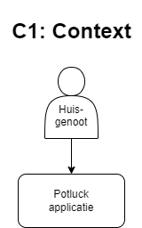
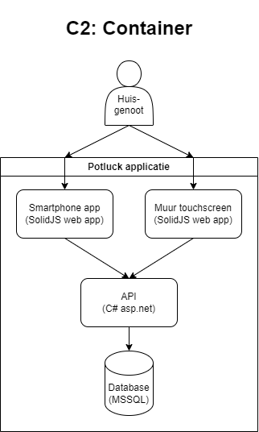
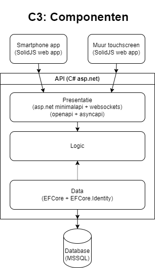

# How

Hoe ga ik het systeem eigenlijk maken?

## Architectuur

De context bestaat uit één soort gebruiker, namelijk huisgenoten.

Deze gebruiker kan twee interfaces gebruiken: een mobiele app en een scherm dat aan de muur hangt. Deze gebruiken alle
twee SolidJS als frontend framework. De API is geschreven in C# met MinimalAPI. De database is Microsoft SQL Server.

De API-applicatie is onderverdeeld in drie lagen: de API zelf, de logicalaag en de datalaag. De logica is de kern van de
applicatie. De API gebruikt deze laag en geeft ook de datalaag mee. Die laag bevat de ORM (entity framework) die de
database aanroept.

## Framework

Ik heb besloten om SolidJS te gaan gebruiken. Dit framework lijkt erg veel op React, maar is iets makkelijker in
gebruik. Ik gebruik SolidUI als component library. Dit bespaart me veel tijd met het maken van de UI.

## Backend

De backend wordt geschreven in C#. Ik heb hier redelijk veel ervaring mee. Ook is het erg makkelijk om een api met
OpenAPI ondersteuning te maken in C# omdat dit ingebouwd is in de taal.

### API

Voor de API gebruik ik ASP.NET MinimalAPI. Dit systeem heeft heel veel functies ingebouwd, waardoor het heel weinig werk
is om een simpele API te maken. Als voorbeeld genereert MinimalAPI automatisch een OpenAPI spec met een Swagger UI. Ook
werkt het perfect samen met EFCore, en het kan hiermee zelfs automatisch login implementeren.

### Database

Als database gebruik ik SQL Server. Dat komt vooral omdat ik er redelijk veel ervaring mee heb, en Fontys een gratis
host hiervoor aanbiedt. Verder maakt het niet heel veel uit welke database ik gebruik, omdat dit achter EFCore (als ORM)
zit. Hierdoor kan ik de data eenvoudig vanuit C# uitlezen en is het niet nodig om SQL te schrijven. Ook heeft EFCore
migraties waardoor ik verzekerd ben dat de database klopt en de gegevens veilig blijven.

## Hosting

Tijdens development heb ik een scriptje die via caddy een proxy op mijn localhost aanmaakt. Hierdoor kan ik de frontend
en de API op localhost gebruiken.

De echte hosting gebeurt via Docker. Die runt ook een caddy server, en daarnaast de containers voor de beide frontends
en de API. Ook de database runt in Docker. Op deze manier kan ik heel makkelijk de applicatie online zetten, en is deze
ook veilig. De Docker runt ook een Cloudflare tunnel die ik aan een domein koppel. Zo kan de app ook echt gebruikt
worden.

## Repo setup

Ik gebruiken een monorepo met mapjes per service of frontend. Hierdoor is het uiteindelijk ook makkelijker om de hele
applicatie online te krijgen.